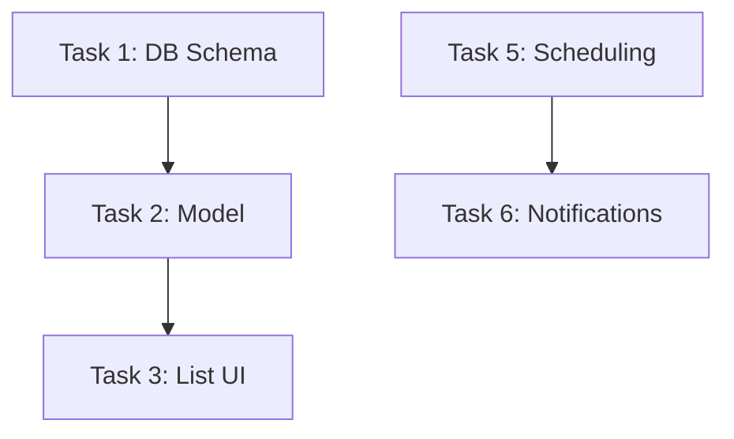

# Scheduling Implementation Plan

## Overview

Takes an existing implementation plan (created by superpowers:writing-plans, manually, or from other workflows) and converts it into actionable sprint tasks in ROADMAP.md and sprint documents.

**Announce at start:** "I'm using the scheduling-implementation-plan skill to schedule this implementation plan into sprints."

## When to Use

- After creating implementation plan with superpowers:writing-plans (outside feature-management workflow)
- When you have implementation plans that need sprint scheduling
- When you want to break a large plan into sprint-sized chunks
- When you need to update ROADMAP.md with tasks from an existing plan
- To bridge standalone implementation plans into the feature-management system

## Dual-Mode Operation

**Interactive Mode (Default):**
- User says "schedule plan" or provides plan filename
- Prompts for plan selection, sprint breakdown, feature linking
- Full human control over sprint boundaries
- Estimated time: 2-7 minutes per plan

**Autonomous Mode:**
- User says "auto-schedule plan [filename]" or "auto-schedule plan"
- Auto-discovers unscheduled plans if no filename provided
- Auto-counts tasks and determines sprint breakdown
- Auto-splits at natural boundaries (phases, sections)
- Creates sprints without prompting for confirmation
- Estimated time: 1-2 minutes per plan

**Mode Selection:**
Mode is determined by invocation phrase:
- Contains "auto-": Use autonomous mode
- Otherwise: Use interactive mode

## Process

### Phase 1: Select Implementation Plan

**List all available implementation plans:**

```
Search for implementation plans in:
- docs/plans/ (all .md files)
- docs/plans/features/ (feature-specific plans)
- Any subdirectories with "plan" in the name

Display:
📋 Available Implementation Plans

Feature Plans:
  • FEAT-001-implementation-plan.md (medication tracking)
  • FEAT-003-implementation-plan.md (document upload flow)

General Plans:
  • authentication-refactor-plan.md
  • database-migration-plan.md

[Count] implementation plans found.
```

**If no plans found:**
- Exit with message: "No implementation plans found in docs/plans/. Create a plan first using superpowers:writing-plans."

**Ask user to select:**
```
Use AskUserQuestion:
Question: "Which implementation plan do you want to schedule?"
Header: "Plan Selection"
multiSelect: false
Options:
  - Label: "FEAT-001-implementation-plan.md"
    Description: "Add medication tracking (12 tasks)"
  - Label: "FEAT-003-implementation-plan.md"
    Description: "Improve document upload flow (8 tasks)"
  [... for each plan found]
```

### Phase 2: Parse Implementation Plan

**Read selected plan and extract:**
1. **Tasks** - Look for numbered lists, checkboxes, or task sections
2. **Dependencies** - Look for "depends on", "requires", "after" keywords
3. **Estimates** - Look for time estimates or complexity indicators
4. **Verification steps** - Look for "verify", "test", "check" sections

**Display parsed information:**
```
━━━━━━━━━━━━━━━━━━━━━━━━━━━━━━━━━━━━━━━━━
Plan: FEAT-001-implementation-plan.md

Tasks Found: 12
  1. Create database schema for medications
  2. Implement medication model with validation
  3. Create medication list UI component
  4. Add medication form with dosage input
  5. Implement reminder scheduling logic
  6. Create notification system integration
  7. Add medication detail view
  8. Implement edit/delete functionality
  9. Add medication history tracking
  10. Create medication export feature
  11. Write unit tests for all components
  12. Write E2E tests for medication flow

Dependencies Detected:
  - Task 3 depends on Task 2 (model must exist)
  - Task 6 depends on Task 5 (scheduling before notifications)
  - Task 11 depends on Tasks 1-10 (test after implementation)

Estimated Complexity: Medium-High (12 tasks)
━━━━━━━━━━━━━━━━━━━━━━━━━━━━━━━━━━━━━━━━━
```

### Phase 3: Sprint Planning Decision

**Ask about sprint structure:**
```
Use AskUserQuestion:
Question: "How should we schedule these tasks?"
Header: "Sprint Planning"
multiSelect: false
Options:
  - Label: "Single Sprint"
    Description: "All 12 tasks in one sprint (2-4 weeks)"
  - Label: "Multiple Sprints"
    Description: "Break into multiple sprints by phase"
  - Label: "Add to Existing Sprint"
    Description: "Add tasks to an already-created sprint"
```

### Phase 4a: Single Sprint Scheduling

**If "Single Sprint" selected:**

**1. Ask for sprint details:**
```
Prompt: "Sprint name?" (e.g., "Sprint 5: Medication Tracking Implementation")
Prompt: "Sprint duration?" (default: 2 weeks)
Prompt: "Sprint goal?" (default: auto-generate from plan title)
```

**2. Generate sprint ID:**
- Read highest sprint ID from existing sprints
- Format as SPRINT-{nextId:03d}

**3. Create sprint structure:**
- All tasks go into one sprint
- Preserve task order and dependencies
- Link back to implementation plan

**4. Skip to Phase 5**

### Phase 4b: Multiple Sprint Scheduling

**If "Multiple Sprints" selected:**

**1. Analyze tasks for natural breakpoints:**
- Look for phases (e.g., "Phase 1: Database", "Phase 2: UI")
- Look for dependencies (tasks that must complete before others)
- Look for complexity (group simple vs complex tasks)

**2. Suggest sprint breakdown:**
```
Suggested Sprint Breakdown:

Sprint 1: Foundation (Tasks 1-2)
  • Create database schema
  • Implement medication model
  Duration: 1 week

Sprint 2: Core UI (Tasks 3-5)
  • Medication list UI
  • Medication form
  • Reminder scheduling
  Duration: 1 week

Sprint 3: Advanced Features (Tasks 6-10)
  • Notification integration
  • Detail view
  • Edit/delete
  • History tracking
  • Export feature
  Duration: 2 weeks

Sprint 4: Testing (Tasks 11-12)
  • Unit tests
  • E2E tests
  Duration: 1 week
```

**3. Ask for approval:**
```
Use AskUserQuestion:
Question: "Accept this sprint breakdown?"
Options:
  - Label: "Yes, use suggested breakdown"
  - Label: "No, let me customize"
```

**4. If customize selected:**
- For each sprint, ask: "Which tasks for Sprint X?" (multiSelect checkboxes)
- Allow user to create custom groupings

**5. For each sprint:**
- Ask: "Sprint name?" (suggest name based on tasks)
- Ask: "Sprint duration?" (suggest based on task count)
- Generate sprint ID (SPRINT-001, SPRINT-002, etc.)

### Phase 4c: Add to Existing Sprint

**If "Add to Existing Sprint" selected:**

**1. List existing sprints:**
```
Read docs/plans/sprints/ directory
List all sprints with status != "completed"

Display:
Active Sprints:
  • SPRINT-001: Core Features (5 tasks, 2 in-progress)
  • SPRINT-002: UX Polish (3 tasks, 0 in-progress)
```

**2. Select sprint:**
```
Use AskUserQuestion with sprint options
```

**3. Ask about task selection:**
```
Use AskUserQuestion:
Question: "Add all tasks or select specific tasks?"
Options:
  - Label: "All Tasks"
    Description: "Add all 12 tasks to sprint"
  - Label: "Select Tasks"
    Description: "Choose which tasks to add"
```

**4. If "Select Tasks":**
```
Use AskUserQuestion (multiSelect: true) with task list from Phase 2
```

### Phase 5: Update ROADMAP.md

**Read existing ROADMAP.md or create new one**

**Update format:**
```markdown
# Project Roadmap

**Last Updated:** [timestamp]

## Current Sprint

**SPRINT-001: [Sprint Name]** (active)
- Goal: [sprint goal]
- Duration: [duration]
- Progress: [calculated]%

### Tasks
- [ ] Task 1: Create database schema for medications
      From: FEAT-001-implementation-plan.md (line 45)
      Dependencies: None
      Status: pending

- [ ] Task 2: Implement medication model with validation
      From: FEAT-001-implementation-plan.md (line 52)
      Dependencies: Task 1
      Status: pending

[... for each task in sprint]

## Upcoming Sprints

**SPRINT-002: [Sprint Name]** (planned)
- [task count] tasks planned
- Tentative start: [calculated from Sprint 1 end]

### Tasks
- [ ] Task 3: Create medication list UI component
      From: FEAT-001-implementation-plan.md (line 67)

[... etc]

## Backlog

[If any tasks not assigned to sprints]

## Implementation Plans

Scheduled Plans:
- FEAT-001-implementation-plan.md → SPRINT-001, SPRINT-002
- FEAT-003-implementation-plan.md → Backlog

---

Generated from implementation plans - do not edit manually
Use /schedule-implementation-plan to update roadmap
```

### Phase 6: Update/Create Sprint Documents

**For each sprint involved:**

**File:** `docs/plans/sprints/SPRINT-XXX-[sprint-name-slug].md`

**Format:**
```markdown
# SPRINT-XXX: [Sprint Name]

**Status:** active (or planned)
**Created:** [date]
**Duration:** [duration]
**Goal:** [sprint goal]
**Source:** [implementation-plan-name.md]

## Tasks from Implementation Plan

### Phase 1: Foundation
- [ ] **Task 1:** Create database schema for medications
  - Source: FEAT-001-implementation-plan.md (line 45)
  - Dependencies: None
  - Status: pending
  - Estimated: 4 hours
  - Verification:
    - Schema passes validation
    - Migration runs successfully

- [ ] **Task 2:** Implement medication model with validation
  - Source: FEAT-001-implementation-plan.md (line 52)
  - Dependencies: Task 1 (database schema)
  - Status: pending
  - Estimated: 6 hours
  - Verification:
    - All validation rules tested
    - Unit tests pass

[... for each task in this sprint]

## Progress

- Total Tasks: [count]
- Completed: [count] ([percentage]%)
- In Progress: [count]
- Pending: [count]
- Blocked: [count]

## Task Dependencies



## Notes

**Implementation Plan:** [link to plan]

**Original plan created:** [date from plan]
**Scheduled into sprint:** [current date]

---

**Last Updated:** [timestamp]
```

### Phase 7: Link Implementation Plan to Sprint

**Update the original implementation plan file:**

Add header metadata:
```markdown
---
scheduled: true
sprints:
  - SPRINT-001 (Tasks 1-4)
  - SPRINT-002 (Tasks 5-8)
  - SPRINT-003 (Tasks 9-12)
scheduled_date: 2025-01-20
roadmap: ROADMAP.md
sprint_docs:
  - docs/plans/sprints/SPRINT-001-medication-tracking-foundation.md
  - docs/plans/sprints/SPRINT-002-medication-tracking-ui.md
  - docs/plans/sprints/SPRINT-003-medication-tracking-advanced.md
---

# Original Implementation Plan

[rest of plan unchanged]
```

### Phase 8: Update Feature (if linked to FEAT-XXX)

**If implementation plan is named FEAT-XXX-implementation-plan.md:**

**Read features.yaml and update the feature:**
```yaml
- id: FEAT-001
  title: "Add medication tracking"
  # ... other fields ...
  status: scheduled  # Update from approved to scheduled
  sprint_id: SPRINT-001  # Link to first sprint
  sprints:  # Add for multi-sprint features
    - SPRINT-001
    - SPRINT-002
    - SPRINT-003
  implementation_plan: docs/plans/features/FEAT-001-implementation-plan.md
  scheduled_at: "2025-01-20T14:15:00Z"
  updated_at: "2025-01-20T14:15:00Z"
```

**Update docs/features/index.yaml accordingly**

### Phase 9: Git Commit

**Create descriptive commit:**
```bash
git add docs/plans/ ROADMAP.md

[If features.yaml updated]
git add features.yaml docs/features/index.yaml

git commit -m "feat: schedule implementation plan into sprints

Plan: [plan-name.md]
Sprints created: [count]

[If single sprint]
Sprint: SPRINT-XXX - [name]
Tasks: [count] tasks scheduled

[If multiple sprints]
Sprints:
- SPRINT-001: [name] (Tasks 1-4)
- SPRINT-002: [name] (Tasks 5-8)
- SPRINT-003: [name] (Tasks 9-12)

[If feature linked]
Feature: FEAT-XXX updated to status=scheduled

Roadmap updated with task breakdown and dependencies.

Implementation plan: [path-to-plan]"
```

### Phase 10: Display Summary

**Show user:**
```
✅ Implementation Plan Scheduled

Plan: FEAT-001-implementation-plan.md
Tasks: 12 total

[If single sprint]
Sprint: SPRINT-001 - Medication Tracking Implementation
  • 12 tasks scheduled
  • Duration: 2 weeks
  • Goal: Implement medication tracking system

[If multiple sprints]
Sprint Breakdown:
  • SPRINT-001: Foundation (2 tasks, 1 week)
  • SPRINT-002: Core UI (3 tasks, 1 week)
  • SPRINT-003: Advanced Features (5 tasks, 2 weeks)
  • SPRINT-004: Testing (2 tasks, 1 week)

[If feature linked]
Feature Updated:
  • FEAT-001: Add medication tracking
  • Status: approved → scheduled
  • Sprint: SPRINT-001 (and 3 more)

Files Updated:
  • ROADMAP.md (tasks added with dependencies)
  • docs/plans/sprints/SPRINT-001-[slug].md (created)
  [• docs/plans/sprints/SPRINT-002-[slug].md (created)]
  [• docs/plans/sprints/SPRINT-003-[slug].md (created)]
  • [plan-name.md] (metadata added)
  [• features.yaml (FEAT-001 updated)]

Task Dependencies Mapped:
  • Task 3 depends on Task 2
  • Task 6 depends on Task 5
  • Task 11 depends on Tasks 1-10

Next Steps:
1. Review sprint documents in docs/plans/sprints/
2. Review ROADMAP.md for task breakdown
3. Start working on tasks (use superpowers:executing-plans if desired)
4. Update task status as work progresses

Changes committed to git.
```

## Integration Points

### With Superpowers Workflow

**Scenario 1: Plan created by superpowers:writing-plans**
```
User: "Create implementation plan for authentication refactor"
→ superpowers:brainstorming
→ superpowers:writing-plans (creates docs/plans/authentication-refactor-plan.md)

User: "Schedule that plan into sprints"
→ scheduling-implementation-plan skill
→ Parses plan, creates sprints, updates ROADMAP.md
```

**Scenario 2: Execute from roadmap**
```
User: "Execute SPRINT-001 tasks"
→ superpowers:executing-plans reads ROADMAP.md
→ Finds tasks for SPRINT-001
→ Executes tasks, updates ROADMAP.md progress
```

### With Feature Management Workflow

**Scenario 1: Feature has implementation plan, needs sprint scheduling**
```
→ reporting-features (creates FEAT-001)
→ triaging-features (approves FEAT-001)
→ superpowers:writing-plans (creates FEAT-001-implementation-plan.md)
→ scheduling-implementation-plan (converts plan to sprints)
→ FEAT-001 updated to status=scheduled, ROADMAP.md updated
```

**Scenario 2: Use scheduling-features instead (all-in-one)**
```
→ scheduling-features (handles everything including superpowers integration)
```

**This skill is useful when you want to:**
- Schedule a plan that was created outside the feature-management workflow
- Break an existing plan into multiple sprints (scheduling-features does single sprint)
- Add tasks from a plan to an existing sprint
- Bridge standalone plans into the roadmap system

## Task Parsing Intelligence

**Recognize different task formats:**

**Format 1: Numbered list**
```
1. Create database schema
2. Implement model
3. Build UI
```

**Format 2: Checkboxes**
```
- [ ] Create database schema
- [ ] Implement model
- [ ] Build UI
```

**Format 3: Headers with descriptions**
```
## Task 1: Create Database Schema
Description: Design and implement medication schema

## Task 2: Implement Model
Description: Build medication model with validation
```

**Format 4: superpowers:writing-plans format**
```
### Implementation Tasks

**Task 1: Create database schema**
- File: src/models/schema.sql
- Action: Create table structure
- Verification: Schema passes validation
```

**Dependency detection keywords:**
- "depends on", "requires", "after", "following"
- "must complete X first", "prerequisite"
- "blocked by", "waiting for"

**Complexity estimation keywords:**
- "simple", "trivial" → 1-2 hours
- "moderate", "medium" → 4-6 hours
- "complex", "large" → 8-16 hours
- Numbers: "4 hours", "2 days"

## Error Handling

**If implementation plan is malformed:**
- Warn user about parse issues
- Show what was detected
- Ask: "Continue with detected tasks or cancel?"

**If no tasks detected:**
- Error: "Could not find tasks in plan. Plans should have numbered lists or checkboxes."
- Show plan format examples
- Exit

**If ROADMAP.md is malformed:**
- Warn user
- Offer to recreate ROADMAP.md from scratch
- Backup existing file before overwriting

**If sprint already exists with same ID:**
- Ask: "SPRINT-XXX exists. Add tasks to existing sprint or create SPRINT-YYY?"

**If git commit fails:**
- Warn user
- Files are still updated
- User can commit manually

## Success Criteria

✅ Parse implementation plans in multiple formats
✅ Detect task dependencies automatically
✅ Break large plans into multiple sprints intelligently
✅ Update ROADMAP.md with task breakdown
✅ Create/update sprint documents with links to plan
✅ Support adding tasks to existing sprints
✅ Link back to original implementation plan
✅ Integrate with feature-management (if FEAT-XXX plan)
✅ Git commit with detailed changelog

## Testing

**Test cases:**
1. Schedule plan with numbered tasks (single sprint)
2. Schedule plan with checkboxes (multiple sprints)
3. Schedule superpowers:writing-plans output
4. Add plan tasks to existing sprint
5. Schedule FEAT-XXX plan (updates features.yaml)
6. Schedule non-feature plan (general plan)
7. Handle plan with dependencies
8. Handle plan with complexity estimates
9. Verify ROADMAP.md updates correctly
10. Verify sprint documents link to plan

## Autonomous Mode - Auto-Detection Logic

### 1. Plan Discovery

If no filename provided, find recent unscheduled plans:

```bash
# Find all implementation plan files
plans=$(find docs/plans/ -name "*-plan.md" -o -name "*-implementation-plan.md" | head -10)

# Check which plans are already scheduled
for plan_file in $plans; do
  # Extract plan name/ID
  plan_name=$(basename "$plan_file" | sed 's/-plan.md$//' | sed 's/-implementation-plan.md$//')

  # Check if plan already mentioned in ROADMAP.md or sprint documents
  if grep -q "$plan_name" ROADMAP.md 2>/dev/null; then
    echo "  ⊗ $plan_file (already scheduled)"
  else
    echo "  ○ $plan_file (unscheduled)"
    unscheduled_plans+=("$plan_file")
  fi
done

# Select most recent unscheduled plan
if [ ${#unscheduled_plans[@]} -eq 0 ]; then
  echo "No unscheduled plans found"
  exit 0
fi

# Use most recent by file modification time
selected_plan=$(ls -t "${unscheduled_plans[@]}" | head -1)
echo "Selected plan: $selected_plan"
```

### 2. Task Counting

Count tasks in plan:

```bash
# Count task markers:
# - "## Task" or "### Task" headings
# - "- [ ]" checkboxes

task_count=$(grep -c "^## Task\|^### Task\|- \[ \]" "$plan_file")

echo "Found $task_count tasks in plan"
```

### 3. Sprint Sizing Heuristics

Determine number of sprints based on task count:

```
≤8 tasks   → 1 sprint (1-2 weeks)
9-16 tasks → 2 sprints (2-4 weeks)
17-24 tasks → 3 sprints (3-6 weeks)
>24 tasks  → 4+ sprints (4-8 weeks)
```

```bash
if [ $task_count -le 8 ]; then
  sprint_count=1
elif [ $task_count -le 16 ]; then
  sprint_count=2
elif [ $task_count -le 24 ]; then
  sprint_count=3
else
  sprint_count=4
fi

echo "Recommended: $sprint_count sprint(s)"
```

## Notes

- This skill bridges standalone implementation plans into the sprint system
- Use scheduling-features for all-in-one feature → sprint flow
- Use this skill for plans created outside feature-management
- ROADMAP.md is updated with task-level detail (not just feature-level)
- Sprint documents preserve all task information from original plan
- Dependencies are preserved and visualized in sprint documents

---

**Version:** 1.0
**Last Updated:** 2025-11-14
**Complements:** superpowers:writing-plans, superpowers:executing-plans, scheduling-features
